# Entrust Datacard IntelliTrust and ForgeRock Access Manager 6.5 Technical Integration Guide

## Introduction

This document describes how to configure a second-factor authentication
node for ForgeRock Access Manager (version 6.5 and newer) by integrating
it with Entrust Datacard IntelliTrust.

The procedures in this document assume that you have these
prerequisites:

  - a working installation of ForgeRock Access Manager and knowledge of
    how to use it

  - a working installation of Entrust Datacard IntelliTrust and knowledge of how
    to use it

## Features

### Multiple second-factor authentication methods

The ForgeRock Access Manager and IntelliTrust integration
provides second-factor authentication in addition to the authentication
offered by the open source access management platform, OpenAM. With this
integration, IntelliTrust can provide the following types of
second-factor authentication:

- **Grid card** - Users respond to a challenge by entering values from
    cells on a grid card in their possession.

- **One-time password** - A one-time password (OTP) is delivered to a
    user by SMS, email, or phone.

- **Knowledge-based authentication** - Users provide answers to
    questions that they have previously registered with IntelliTrust.

- **Hardware or software token** - Users manually enter a
    security code displayed on their hardware token or software token,
    or copy and paste the code from a software token.

- **Push notification with IntelliTrust mobile apps (Soft
    Token or Smart Credential)** - To authenticate, users respond to a
    challenge notification sent to their mobile apps by selecting
    a **CONFIRM** button.

- **Temporary Access Code** - Users manually enter a
	single-use authentication code sent to a their phone, mobile device,
	 or e-mail address.

## Installation

Installation of the integration consists of deploying a JAR file to
ForgeRock Access Manager 6.5 (or newer) through an Apache Tomcat server.

### Download and deploy the JAR file

1.  Download the **EDCIntelliTrustForgeRock-1.0.0.jar** file.

2.  On a computer where the Apache Tomcat web application server is
    installed, copy the JAR file to the following location:

    \<TOMCAT\_HOME\>/webapps/openam/WEB-INF/lib

3.  Restart Apache Tomcat to pick up the new ForgeRock nodes for
    IntelliTrust.

	After deploying the JAR file, the following Entrust Datacard IntelliTrust tree
	nodes are available in the **Components** palette of the ForgeRock
	tree designer. From where they can be added to authentication trees:

	

## Configuration ###

###Add ForgeRock Access Manager to IntelliTrust###

To integrate ForgeRock Access Manager with IntelliTrust, you need to generate an **Application ID** in IntelliTrust.

1. Log in to your IntelliTrust account.

2. In IntelliTrust, from the Home menu select **Resources > Applications**. The **Applications** page appears.

3. Click **+** (**Add**). The **Add Applications** page appears.

4. Click **Add**. The **Add Applications** page appears.

5. Scroll to **IntelliTrust Integrations** and select **IntelliTrust ForgeRock**.

6. In the **Application Name** field, type a name for your application.

7. In the **Application Description** field, type a description for your application.

8. Optional. Add a custom application logo, as follows:

	a. Click **+** (**Add**) next to **Application Logo**. The **Upload Logo** dialog box appears.

	b. Click the upload icon to select an image file to upload.

	c. Browse to select your file and click **Open**. The Upload Logo dialog box reappears showing your selected image. If required, resize your image.

	d. Click **OK**.

9. Click **Next**. The **General Settings** appear.

10. Select **Provided in the API** for the **Source of Client IP Address for Risk Conditions**.

11. Click **Submit**. The **Application ID** is generated. You need this ID when you configure IntelliTrust Nodes in ForgeRock Access Manager.

12. Copy the **Application ID**. You need this ID when you complete the procedure, *Configure IntelliTrust Nodes in ForgeRock Access Manager*.

13. Click **Done**.

###Protect Access to ForgeRock Access Manager with a Resource Rule###
Create a Resource Rule in IntelliTrust to protect access to ForgeRock Manager Access Manager. The Resource Rule determines the authentication conditions required to access ForgeRock Access Manager.

1. Log in to your IntelliTrust account.

2. In IntelliTrust, from the Home menu select **Resources > Resource Rules**. The **Resource Rules** page appears.

3. Scroll to **IntelliTrust Applications** and click **+** next to **IntelliTrust ForgeRock**. The **Add Resource Rule** page appears.

4. Change the **Rule Name** if required and provide a **Rule Description**.

5. In the **Groups** list, select the group or groups of users restricted by the resource
rule. These are the groups to which the resource rule applies. If you do not select any
groups, by default the resource rule will apply to all groups.

6. Click **Next**. The **General Settings** page appears. On this page you set the **Authentication Conditions** and the **Authentication Decisions**.

7. To help you set the Authentication Conditions and Decisions, refer to the *IntelliTrust Administration Online Help* for guidance. Access the help as follows:

	a. In IntelliTrust, in the top-right next to your account name, click the menu (three dots).

	b. Select **Help > Administration Guide**. The *IntelliTrust Administrator Help* appears. **Tip:** Drag the Help tab to a new window so that you can refer to the documentation while you set the Authentication Conditions and Decisions for your resource rule.

	c. In the Help table of contents, expand **Manage Resources > Manage Resource Rules**.

8. Using the Help as reference, set the **Authentication Conditions** and **Authentication Decisions**.  

9. For **Risk-based Authentication**, the RBA settings and the resource rules for the application work together to define the level of authentication required to access the application. Note the following if you want to allow **Risk-based Authentication**:

    Risk-based authentication (RBA) identifies the level of risk associated with every
    user who attempts to authenticate to your IntelliTrust account. This feature is
    useful when you want your users who access IntelliTrust to be

    - Immediately accepted

    - Given an extra authentication challenge

    - Denied access based on their apparent level of risk

     See the section, **Manage Resource Rules** in the *IntelliTrust Administration Online Help* for more information on configuring RBA.

### Configure the IntelliTrust nodes in ForgeRock Access Manager

When the JAR file is deployed, five new nodes are visible in your ForgeRock
Access Manager Tree designer. Some of the nodes require no
configuration. Others require configuration to achieve specific
behaviors in your integration. Configuration options are described in
the procedure, “Configure the authentication tree."

### Configure the authentication tree

1. Log in to **ForgeRock Access Manager**.

2. Click **Top Level Realm**.

	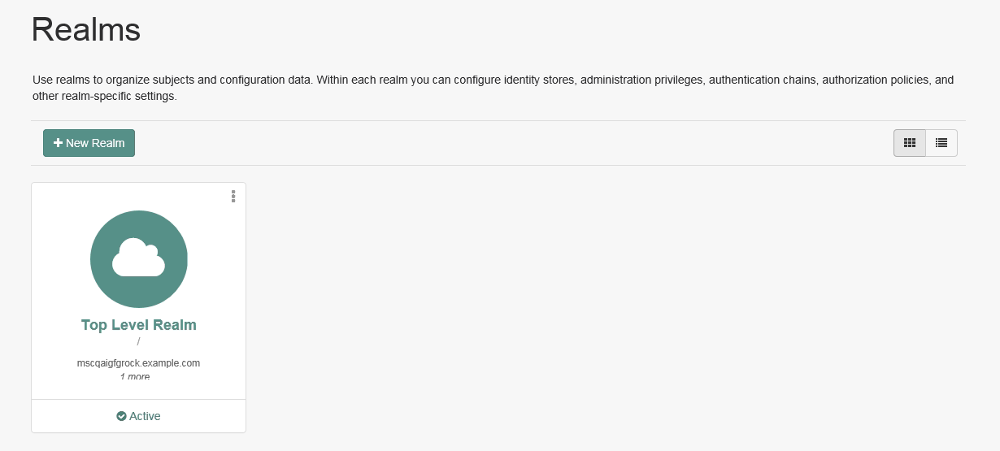
3. To create IntelliTrust authentication work flows, in the
    navigation pane click **Authentication \> Trees**.
    The **Trees** page appears.

	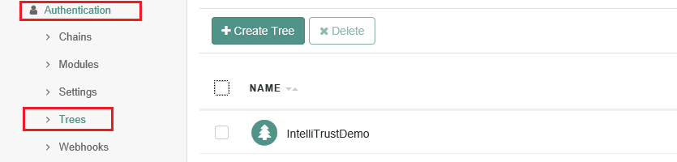

4. Click **Create Tree**.

5. Enter a name for the tree.

6. Create the first- and second-factor authentication tree, as follows:

	a. From the **Components** list, drag the following components to the tree in the order they are listed here:

	- Page Node

	- Username Collector - Drag this node onto the Page Node.

	- Password Collector - Drag this node onto the Page Node.

	- Data Store Decision

	- IntelliTrust Auth Type Selector

	- IntelliTrust Collector Decision

	- IntelliTrust Input Challenge Collector

	- IntelliTrust Push Challenge Collector

	- IntelliTrust Auth Decision

	- Success

	- Failure

	b. Wire them together as shown in the following diagram.

	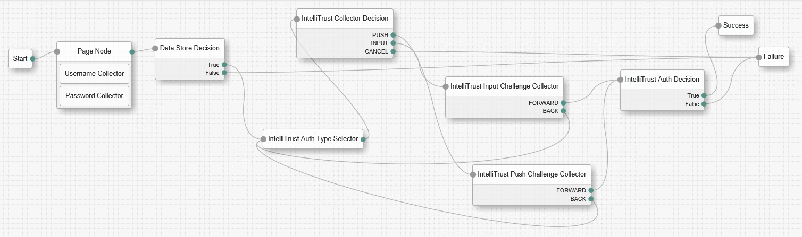

7. In the tree, click **IntelliTrust Auth Type Selector**, and then configure
    the following settings in the **IntelliTrust Auth Type Selector** dialog box.

	<!-- end list -->
   	- **IntelliTrust Server URL** specify an IntelliTrust Server URL.

    	Specify each URL in the following format: {https}://{hostName/Ip
    	Address}:{port}/

    	Example:

    	https://IntelliTrust.example.com/

    - **Authentication Application ID**
    Authentication Application ID into which IntelliTrust API calls being used by the application. This is the ID your created when you added ForgeRock AM to IntelliTrust.

    - **Allow User Authenticator Selection** By default, users can
    select a second-factor authenticator to use, if they have more than
    one. IntelliTrust displays a challenge for the first
    second-factor authenticator listed in the IntelliTrust
    resource rule for the application. Disable this option if you do not
    want to offer users a choice.

    - **Enable Second-factor Bypass** When enabled, this option allows
    ForgeRock users to authenticate even when they have not enrolled for
   IntelliTrust accounts.
	<!-- end list -->

8. In the tree, click **IntelliTrust Input Challenge Collector**, and then
    configure the setting in the **IntelliTrust Input Challenge Collector**
    dialog box.
	<!-- end list -->
	- **Mask Answers** - If this option is enabled, the response
	entered by the user is masked with characters such as asterisks
	or discs.
	<!-- end list -->

9.	In the tree, click **IntelliTrust Push Challenge Collector**, and then
    configure the settings in the **IntelliTrust Push Challenge Collector**
    dialog box.

	<!-- end list -->
	- **Polling Interval** - This option specifies the time interval, in
    seconds, to wait between calls to check for a user response. This
    allows users time to complete a mobile soft token authentication on
    their mobile devices. The default is 2 seconds.

	- **Fallback to Classic** - When this option is enabled, a user can be
    redirected to the “classic” token response page if the time allowed
    for a soft token push authentication elapses without a response.
    This allows users to enter the security code from the token manually
    if they do not have an Internet connection.
	<!-- end list -->

10. Click **Save**.

## Test two-step authentication

1.  Open a browser window.

2.  Browse to the ForgeRock Access Manager URL.

	Example:

	[http://forgerock1.example.com:8080/openam/XUI/?\&service=IntelliTrust/](http://forgerock1.example.com:8080/openam/XUI/?&service=IntelliTrustDemo#login/)
	The standard ForgeRock login page appears.

3.  Enter your **User name** and **password**.

4.  Click **Log in**.

	A page appears with an Entrust Datacard IntelliTrust second-factor challenge.

	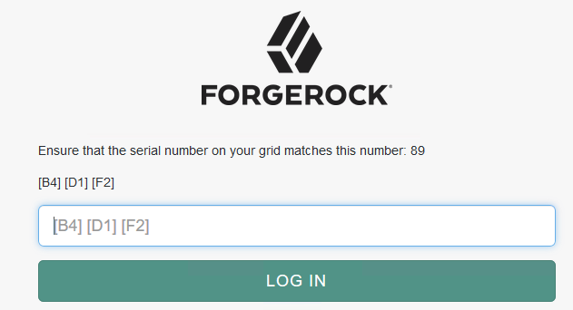

	The example above shows a grid as the second-factor challenge. You
	might see a different challenge, depending on the second-factor
	authentication method you have configured or selected.

5.  Enter your response to the second-factor challenge. Example: Consult
    your grid card and enter the values at B4, D1, and F2.

6.  Click **Log in**.

	On successful authentication, the user is redirected to the resource
	page configured with ForgeRock AM.

## Change the logging level

1.  Log in to the ForgeRock administration URL:
    http://\<hostname.domain.com:8080/openam/Debug.jsp

2.  From the **Debug instances** drop-down list,
    select **EDCIntAuthenticationRestApi**.

	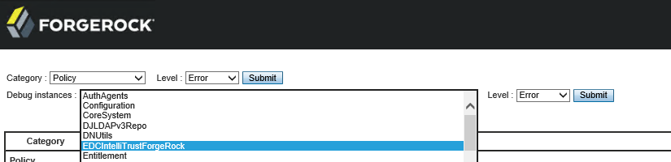

3.  From the **Level** drop-down list to the right, select the logging
    level you want. **Errors** logs only error
    messages, **Warnings** logs errors and warnings,
    and **Messages** logs errors, warnings and informational messages.

4.  Click **Submit**. The screen shows a summary of the change you have
    made.

	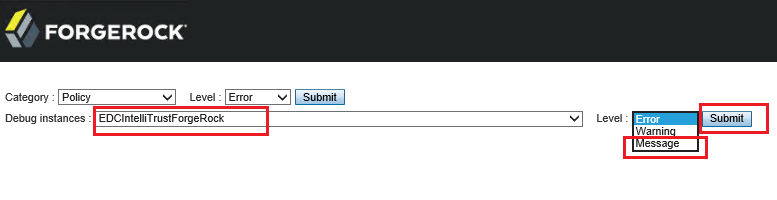

5.  Click **Confirm**.

	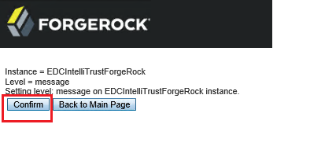

	The screen displays a success message.

6.  Repeat steps 2 to 5, this time selecting IntelliTrust Auth Node Logs from
    the **Debug instances** drop-down list.

## User experience of second-factor authentication types

The following screen captures show authentication challenges that users
could see when using ForgeRock AM integrated with Entrust Datacard IntelliTrust.

### Choose a second-factor authenticator

This is the page on which a user selects the type of second-factor
authenticator to use.

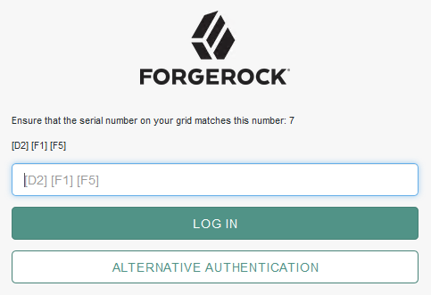

If a user has more than one authenticator but is unable to use the one
requested by the challenge (for example, left the grid card at home),
the user can select **Alternative Authentication** and then select
another type of second-factor challenge.

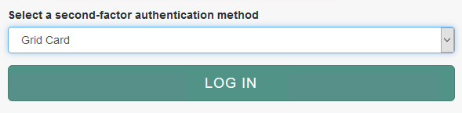

### Grid card challenge

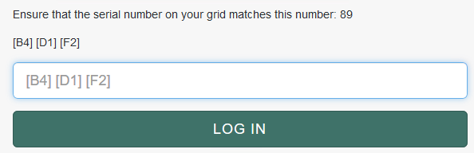

### Knowledge-based authentication challenge

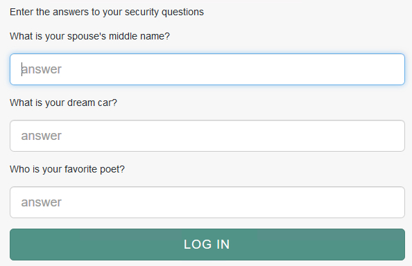

### Select a delivery location for a one-time password (OTP)

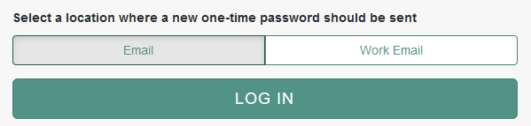

### Classic token response challenge

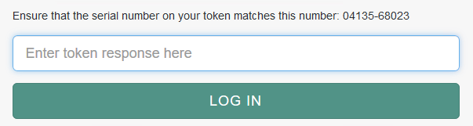

### Push authentication challenge for Mobile Soft Token

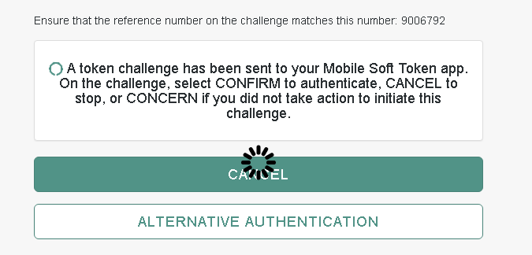

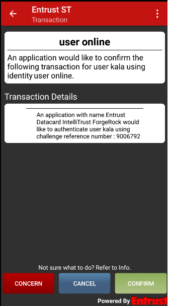

### Push authentication challenge for Mobile Smart Credential

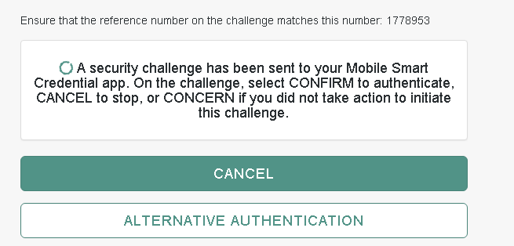

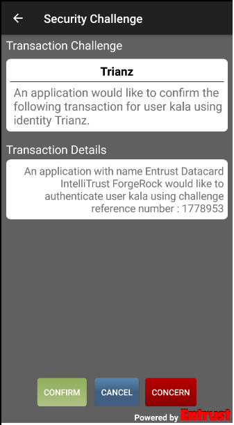

### Temporary Access Code challenge

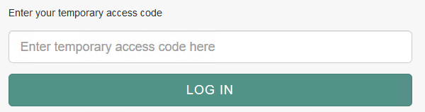
